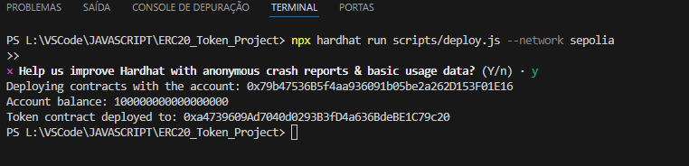

# Token Zero Web3

Este projeto faz parte do desafio "Criando o Seu Primeiro Token do Zero nos Padrões Web3", onde foi desenvolvido um contrato inteligente ERC20 utilizando a rede Sepolia para testes, através de ferramentas como Hardhat, Metamask, e Infura.

## Objetivo do Desafio

O objetivo deste desafio foi desenvolver e fazer o deploy de um contrato ERC20 do zero, utilizando as bibliotecas e ferramentas do ecossistema Web3. Além disso, o desafio incluiu a configuração correta de uma rede de teste (Sepolia), a integração com a Metamask e a interação com a blockchain para o deploy do contrato.

## Tecnologias Utilizadas

- **Solidity**: Linguagem de programação para contratos inteligentes.
- **Hardhat**: Framework de desenvolvimento para Ethereum, usado para compilar, testar e fazer deploy de contratos inteligentes.
- **Metamask**: Carteira Ethereum para interagir com a blockchain.
- **Infura**: API usada para se conectar à rede Ethereum sem a necessidade de rodar um nó completo.
- **Node.js**: Ambiente de execução para JavaScript, usado para gerenciar o projeto.
- **Sepolia Testnet**: Rede de testes utilizada para fazer deploy do contrato ERC20.

## Estrutura do Projeto

    ERC20_Token_Project/
    ├── contracts/
    │   └── Token.sol        # Arquivo do contrato inteligente ERC20
    ├── migrations/
    │   └── 1_deploy_contracts.js  # Script para o deploy do contrato
    ├── scripts/
    │   └── deploy.js        # Script para deploy do contrato via Hardhat
    ├── test/
    │   └── token.test.js    # Testes unitários para o contrato ERC20
    ├── hardhat.config.js    # Configuração da rede, incluindo Infura e Metamask
    ├── package.json         # Arquivo de configuração do projeto Node.js
    ├── .gitignore           # Arquivos ignorados pelo Git
    ├── README.md            # Documentação do projeto
    └── LICENSE              # Licença do projeto

## Comandos Utilizados

1. Instalação de Dependências

    npm install --save-dev hardhat
    npm install --save-dev @nomiclabs/hardhat-waffle @nomiclabs/hardhat-ethers ethers

2. Compilação do Contrato

    npx hardhat compile

3. Deploy do Contrato

    npx hardhat run scripts/deploy.js --network sepolia

4. Rodando os Testes

    npx hardhat test

5. Obtenção de ETH de Teste

Para realizar o deploy do contrato na rede Sepolia, foi necessário utilizar um faucet para obter ETH de teste:

    Sepolia Faucet da Alchemy
    Sepolia Faucet - Chainlink

## Deploy do Contrato

O contrato ERC20 foi deployado na rede de teste Sepolia com o seguinte comando:

    npx hardhat run scripts/deploy.js --network sepolia

## Bibliotecas Instaladas

    hardhat: Framework de desenvolvimento para Ethereum.
    @nomiclabs/hardhat-waffle: Integração do Hardhat com a biblioteca de testes Waffle.
    @nomiclabs/hardhat-ethers: Integração do Hardhat com a biblioteca ethers.js.
    ethers: Biblioteca para interagir com a blockchain Ethereum.

## Histórico das Dificuldades Enfrentadas Durante o Desafio

Durante o desafio "Criando o Seu Primeiro Token do Zero nos Padrões Web3", enfrentei diversos desafios técnicos que foram superados ao longo do processo de desenvolvimento.

A seguir está um resumo das principais dificuldades e as soluções encontradas:

1. Configuração Inicial do Projeto

A primeira etapa foi configurar corretamente o ambiente de desenvolvimento com o Hardhat. Embora eu já tivesse experiência anterior com o framework, precisei ajustar algumas dependências e configurar corretamente o arquivo hardhat.config.js para conectar à rede de teste Sepolia. A integração com o Infura também apresentou algumas dificuldades, já que tive que gerar uma chave API e configurá-la corretamente no projeto.
2. Problemas com Instalação de Dependências

Durante o processo de instalação das dependências, enfrentei algumas vulnerabilidades de segurança. Embora fossem de baixa severidade, a quantidade de pacotes que precisavam ser atualizados causou certa preocupação. Após resolver as dependências e ajustar o ambiente de desenvolvimento, segui com o processo de deploy do contrato.
3. Insufficient Funds - Erro de Saldo Insuficiente

Um dos maiores desafios foi o erro de saldo insuficiente durante o deploy do contrato. A rede Sepolia, assim como outras redes de teste, exige que o desenvolvedor tenha uma quantidade mínima de ETH de teste para pagar as taxas de gas. Para resolver essa questão, foi necessário utilizar faucets, e o processo envolveu a obtenção de 0.1 Sepolia ETH através do faucet da Alchemy. Esse processo foi crucial para continuar o deploy do contrato.
4. Problemas com Rede de Teste Goerli

Inicialmente, havia a intenção de usar a rede Goerli para o deploy, porém enfrentei dificuldades ao tentar adicionar a rede na Metamask. Após várias tentativas de configuração manual e utilizando diferentes RPC URLs, decidimos migrar para a rede Sepolia, que estava funcionando corretamente e apresentava um processo mais estável para a execução do desafio.
5. Deploy e Sucesso Final

Finalmente, após ajustar o saldo na carteira e configurar corretamente o arquivo de deploy, o contrato ERC20 foi deployado com sucesso na rede Sepolia. O endereço do contrato foi obtido, e o processo de verificação e importação dos tokens na Metamask ocorreu sem maiores problemas. O contrato foi verificado através do explorador de blocos Sepolia, e o desafio foi finalizado com êxito.

## Endereço do Contrato

O contrato ERC20 foi deployado com sucesso na Sepolia Testnet. O endereço do contrato é:

    0xa4739609Ad7040d0293B3fD4a636BdeBE1C79c20

## Como Importar o Token na Metamask

    Abra a Metamask.
    Vá para Importar Tokens.
    Insira o endereço do contrato: 0xa4739609Ad7040d0293B3fD4a636BdeBE1C79c20.
    Confirme e importe o token.

## Licença

Este projeto está licenciado sob a MIT License.
